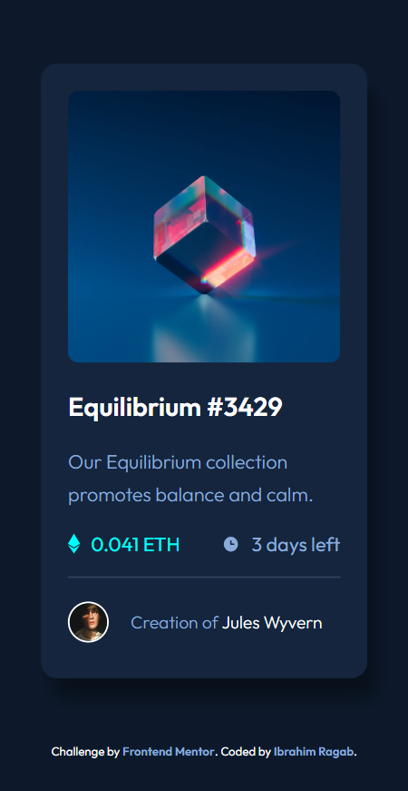

# Frontend Mentor - NFT preview card component solution

This is a solution to the [NFT preview card component challenge on Frontend Mentor](https://www.frontendmentor.io/challenges/nft-preview-card-component-SbdUL_w0U). Frontend Mentor challenges help you improve your coding skills by building realistic projects.

## Table of contents

- [Overview](#overview)
- [The challenge](#the-challenge)
- [Screenshot](#screenshot)
- [Links](#links)
- [Built with](#built-with)
- [Useful resources](#useful-resources)
- [Author](#author)

## Overview

### The challenge

Users should be able to:

- View the optimal layout for the site depending on their device's screen size
- See hover states for all interactive elements on the page

### Screenshot

- Desktop View

- Mobile View

### Links

- Solution URL: [Solution](https://github.com/IbrRagab/NFT_Preview_Card_Component)
- Live Site URL: [live site](https://ibrragab.github.io/NFT_Preview_Card_Component)

### Built with

- Semantic HTML5 markup
- CSS custom properties
- CSS Grid
- Media Queries
- Mobile-first workflow

### Useful resources

- [Resource 1](https://elzero.org/tracks/front-end)
- [Resource 2](https://www.youtube.com/@ElzeroWebSchool)

## Author

- Frontend Mentor - [@IbrRagab](https://www.frontendmentor.io/profile/IbrRagab)
- GitHub - [@IbrRagab](https://github.com/IbrRagab)
